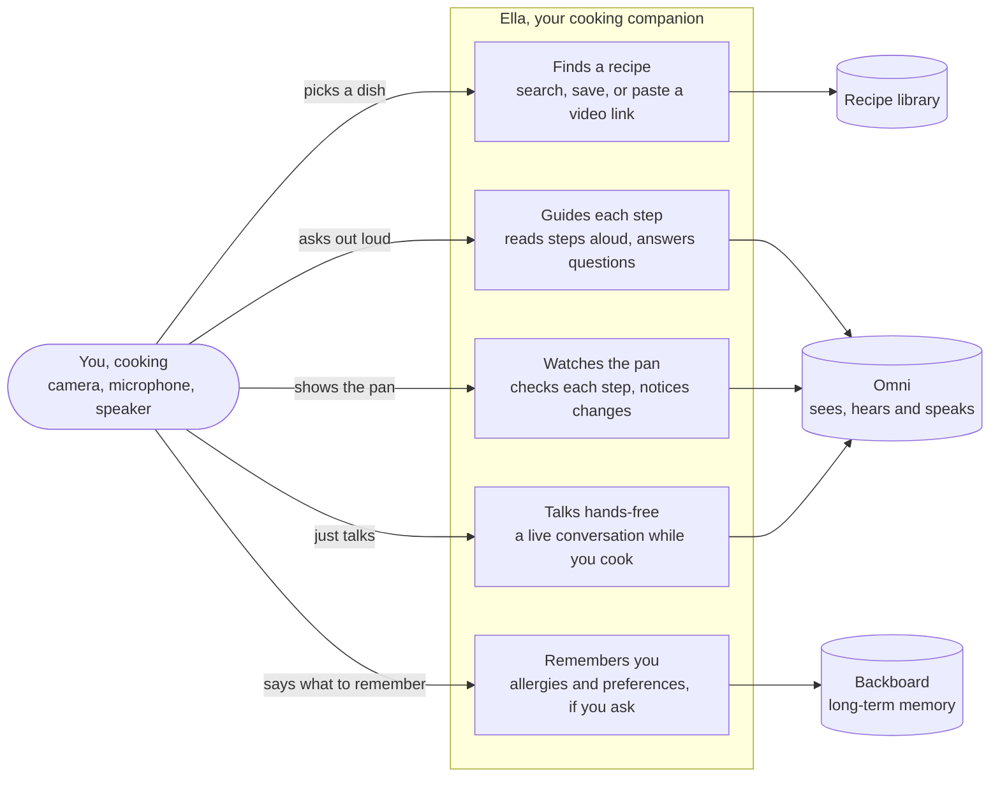

# Whisker

Whisker is an AI cooking mentor. **Whisk-Ella**, your masterchef cat (Ella for short), teaches you the recipe, watches your steps through the camera, and answers your questions out loud, so your messy hands stay off the screen. Speech, hearing and vision all run on Omni (Qwen3.5-Omni via yibuapi).

What is real and what is still a placeholder is tracked in [docs/status.md](docs/status.md). Read that before you demo.

## What it does

- **Explore and cookbook.** Search recipes, filter by diet, save favourites. The saved cookbook lives in your browser only (`localStorage`). The upload page turns a video link into a recipe.
- **Cooking view.** Step through a recipe with your camera on. **Repeat** reads the current step aloud, and the recipe's overflow menu switches the spoken language between English, French and Spanish.
- **Ask Ella.** Tap, ask a question out loud, tap again, and hear the answer.
- **Check step.** Takes one photo and says whether the step looks done, and what is missing if it isn't.
- **Hands-free.** A live two-way voice session, plus a camera coach that looks at the pan and speaks up when something changes.
- **Cooking memory (optional).** Tell Ella "remember I'm allergic to peanuts" and it is kept for next time. Needs a Backboard key; see [docs/backboard-memory.md](docs/backboard-memory.md).

## How it works

Ella can do five things for you while you cook. She sees through your camera, hears through your microphone, and talks back.



Under the hood, three programs run on your machine and the browser talks to all of them. The keys stay on the servers.

| Program | Port | What it does |
| --- | --- | --- |
| `frontend/` | 3000 | The app, and two server routes for recipes. |
| `voice/` | 8000 | Turns audio, photos and text into spoken or written answers through Omni. Also the camera coach, memory, and the test and usage pages. |
| `backend/` | 8001 | The live relay: holds the Omni Realtime WebSocket so the browser never sees the key. |

## Folder layout

```
Kitchen-Companion/
├── frontend/     Next.js app: recipes, cookbook, cooking view
├── voice/        Voice service (FastAPI)
│   ├── app.py            routes
│   ├── agent.py          camera coach: what to say and do for each frame
│   ├── vision.py         "check my step" prompt and parsing
│   ├── backboard_memory.py, usage.py, yibu_audit.py
│   ├── static/           test pages: /voices, /vision, /usage
│   ├── test-page/        standalone push-to-talk page
│   ├── samples/, tests/
│   └── requirements.txt
├── backend/      Live relay (FastAPI) and its tests
├── vision/       Camera test script; the vision check itself runs inside voice/ for now
├── docs/         Notes and write-ups (start with docs/status.md); whisker-banner.gif is the banner below
├── scripts/      Helper and probe scripts, and the usage report
├── examples/     Vendor API examples (read-only reference)
├── artifacts/    API call log, written by the voice service
├── .backboard/   Backboard tool settings and session logs
├── .env.example  Template for the shared config
└── .env          Your real keys (git-ignored, never commit)
```

## Set up

You need **Node 20 or newer** and **Python 3.12**. Do this once, from the repository root.

**Windows (PowerShell)**

```powershell
cd frontend; npm install; cd ..
python -m venv .venv
.\.venv\Scripts\python -m pip install -r voice/requirements.txt -r backend/requirements.txt
Copy-Item .env.example .env
Copy-Item frontend\.env.local.example frontend\.env.local
```

**macOS / Linux**

```bash
(cd frontend && npm install)
python3 -m venv .venv
.venv/bin/python -m pip install -r voice/requirements.txt -r backend/requirements.txt
cp .env.example .env
cp frontend/.env.local.example frontend/.env.local
```

Then open `.env` and fill in at least `OMNI_KEY`. The Python services and the frontend's server routes read this file. `frontend/.env.local` holds only the service URLs, which already point at `localhost`, so it needs no edits.

Settings in the root `.env`:

| Variable | Needed for | Notes |
| --- | --- | --- |
| `OMNI_KEY` | everything | **Required.** Never put it in the frontend. |
| `OMNI_BASE_URL`, `OMNI_MODEL` | voice, recipe import | Default `https://yibuapi.com/v1` and `qwen3.5-omni-flash`. |
| `OMNI_REALTIME_MODEL`, `OMNI_REALTIME_ENDPOINT` | live relay | Default `qwen3.5-omni-plus-realtime` and `wss://yibuapi.com/v1/realtime`. |
| `OMNI_VOICE` | voice | Default `Tina`. Browse all 56 at http://localhost:8000/voices. |
| `RECIPE_API_KEY` | Explore page | Server-side only, from recipeapi.io. |
| `BACKBOARD_API_KEY` | cooking memory (optional) | Lets Ella remember things you ask her to, like an allergy, from one cooking session to the next. Create a key at Backboard, add it here, and restart the voice service. `curl http://localhost:8000/health` then shows `"backboard_configured": true`. Without a key she simply doesn't remember; cooking, the camera and voice all work as normal. |
| `USAGE_PAGE_PASSWORD` | usage page | Leave empty to turn the page off. Pick a strong one. |
| `USAGE_EXTRA_LEDGERS` | usage page | Other call logs to include in the totals. |
| `SENTRY_DSN`, `SENTRY_ORG`, `SENTRY_PROJECT`, `SENTRY_AUTH_TOKEN` | error tracking | Optional; see [docs/sentry-observability.md](docs/sentry-observability.md). |
| `VOICE_MOCK=1` | testing | Makes the voice service's ask, speak and vision-check routes answer with canned replies and spend nothing. |

## Run it

Open **three terminals** in the repository root, one per program. Starting the Python programs with the virtual environment's own Python means you never have to activate it.

| Terminal | Windows (PowerShell) | macOS / Linux |
| --- | --- | --- |
| 1. Voice service | `.\.venv\Scripts\python -m uvicorn voice.app:app --reload --port 8000` | `.venv/bin/python -m uvicorn voice.app:app --reload --port 8000` |
| 2. Live relay | `.\.venv\Scripts\python -m uvicorn backend.app:app --reload --port 8001` | `.venv/bin/python -m uvicorn backend.app:app --reload --port 8001` |
| 3. Frontend | `cd frontend` then `npm run dev` | `cd frontend && npm run dev` |

**What you should see**

| Terminal | Ready when it prints |
| --- | --- |
| Voice service, live relay | `Uvicorn running on http://127.0.0.1:8000` (or `:8001`) and `Application startup complete.` |
| Frontend | `Ready in …` and `Local: http://localhost:3000`. The first page load takes several seconds while Next compiles. |

Check the two Python services without spending credits:

```bash
curl http://localhost:8000/health    # {"ok": true, ...}
curl http://localhost:8001/health    # {"ok": true, "omni_key_configured": true, ...}
```

Then open **http://localhost:3000**. Use `localhost`, not your network address: browsers only allow the camera and microphone on `localhost` or https.

### Your first cook

1. On **Explore**, open a recipe and press **Start cooking**. Allow the camera and microphone when the browser asks.
2. **Back** and **Next step** move through the recipe, **Repeat** reads the current step aloud, and **What's next** peeks at the following step.
3. **Check step** takes a photo and tells you whether the step looks done.
4. **Ask Ella**: tap, ask your question, tap again to send it.
5. **Enable hands-free Ella** starts a live conversation and turns on the camera coach. This one needs the live relay (terminal 2) running.

### Try it without spending credits

- Set `VOICE_MOCK=1` in `.env` and restart the voice service. The ask, speak and vision-check routes then return canned answers and make no Omni call.
- `curl http://localhost:8000/health` and the tests below never call Omni.

```bash
python -m unittest backend.test_app                # from the repo root
cd voice && python -m unittest discover -s tests   # the voice service
cd frontend && npx tsc --noEmit && npx eslint src  # the frontend
```

### Stopping and restarting

- Stop a program with **Ctrl+C** in its terminal.
- All three reload when you change their code. A change to `.env` needs a restart of the program that reads it (voice, relay and frontend all read it at startup).

### From another device

Cameras and microphones only work over `localhost` or https, so a phone needs an https tunnel to the frontend. Its `frontend/.env.local` service URLs must then be addresses that the phone can reach, and the Python services must listen on your network (`--host 0.0.0.0`). The services allow requests from any origin while we develop, so don't expose them publicly.

## If something goes wrong

| You see | Try this |
| --- | --- |
| "Ella can't see" or "The camera is busy" | Only one app can use the camera at a time. Close Zoom, Teams, OBS, the `/vision` page and any editor preview pane showing the app, then press **Try again**. |
| "Camera is blocked" | Click the lock icon in the address bar and set Camera to Allow. |
| "…couldn't check that step. Is the voice service running?" | Start the voice service (terminal 1). |
| Hands-free won't start | Start the live relay (terminal 2) and check that `curl http://localhost:8001/health` says `omni_key_configured: true`. |
| No spoken reply, only text | The voice service is down or Omni returned text only; the app then falls back to the browser's own voice. |
| Ella can't hear you | Windows uses your default input device: Settings, System, Sound, Input. Pick the right one and raise its volume. |
| `only one usage of each socket address` | That port is already taken by an old copy. Stop it: `Get-NetTCPConnection -LocalPort 8000 \| ForEach-Object { Stop-Process -Id $_.OwningProcess -Force }` (change the port number as needed). |
| `ModuleNotFoundError` when starting a Python program | Run the install step again, and start it with the `.venv` Python as shown above. |

## Built with

| Part | What |
| --- | --- |
| Frontend | Next.js 16, React 19, TypeScript, Tailwind CSS 4 |
| Services | Python 3.12, FastAPI, uvicorn, httpx, websockets |
| Speech, hearing, vision | Omni (Qwen3.5-Omni) through yibuapi: chat for photos and clips, Realtime for live voice |
| Memory | Backboard (optional) |
| Error tracking | Sentry (optional) |
| Recipes | recipeapi.io |

## Privacy and data

- Camera photos and microphone audio go from your browser to our servers, and on to Omni to be understood. The Omni key never reaches the browser.
- The call log (`artifacts/yibu_api_calls.jsonl`) records the time, model, purpose and token counts of each call. It does not record prompts, photos or audio.
- The cookbook stays in your browser.
- Cooking memory keeps only what the cook explicitly asks it to remember, under an anonymous per-browser id. Casual speech is not saved.

<p align="center">
  
</p>
